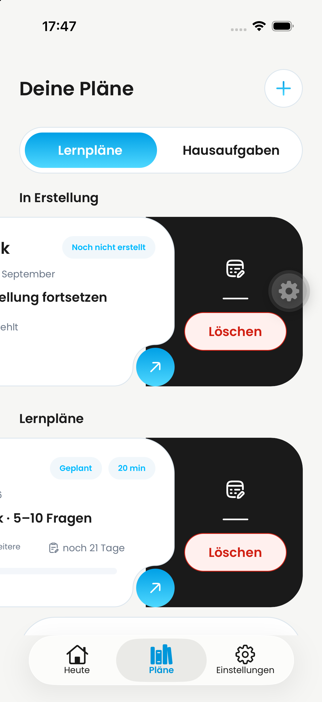
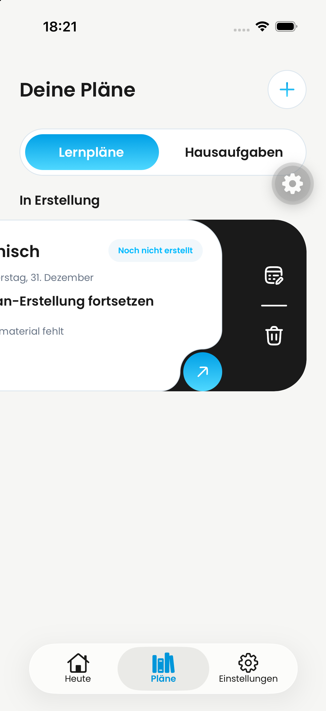

# DAY-474 — Restore the learning-plan swipe delete icon

## Scope

Restore the original white trash icon and 104-point reveal width in the black learning-plan action rail. No red pill or visible delete label. Preserve the accessible “Lernplan löschen” label and the existing delete handler. Confirmation dialogs and subject/learning-time actions are unchanged.

## Visual evidence

Before: user-supplied iPhone screenshot, 2026-09-24 17:47.

After: native iPhone simulator, iOS 26.4, 2026-09-24 18:21, combined QA branch with this patch. Opened Plans and swiped the draft card. White edit/trash icons and separator are visible; no red pill remains. Both draft and active plan cards use the same action rail; an active plan was not separately exercised in this run.

## Validation

- TypeScript: `tsc --noEmit` passed.
- Biome: changed screen passed.
- Six tests across button, learning-plan-card-visual and learning-plan-card-footer passed.
- Native Maestro navigation/swipe flow passed; resulting screenshot visually inspected.
- Diff reviewed against the original icon implementation from before c7dec5c3.
- No records deleted. Android and dark mode were not re-tested; no production release is claimed.
