# Popup action follow-up — 24 September 2026

User-supplied original PNGs. Current iPhone captures show popup spacing in QA #728 (45faaa23), BEFORE this follow-up changes the cancellation and swipe-delete buttons. Historical before images have no verified commit mapping and include different platforms/themes; not a pixel-matched comparison.

## Changes

- Saturated light-mode danger action (#D12013 on #FFF0EE), preserving AA label contrast; dark unchanged.
- Shared cancel variant matches the outlined card-surface appearance of Add subject. All app ConfirmationSheet cancellations use it; OS-owned picker cancellation stays native.
- Subject and learning-time swipe delete use the shared icon-free destructive Button; callbacks and confirmations unchanged.
- Popup header spacing and handle unchanged.

## Validation

84 UI suites / 392 tests passed after the implementation. Added cancellation regression then re-ran 3 affected suites / 9 tests successfully. Theme contrast tests: 7 passed. TypeScript and changed-file Biome passed. No production deployment. Native visual verification is recorded separately in PR comments; these user screenshots are not evidence of the new button state.

## Original PNGs

Final automated run: **84 suites / 393 UI tests passed**.

iPhone Light native walkthrough passed: opened/cancelled Add subject, exposed
swipe delete, opened/cancelled the confirmation. No subject was deleted.
The captures below prove button shape, no trash icon, and outlined cancellation;
the server was subsequently cold-restarted to ensure refreshed CSS color tokens.
They are not an independent color-value measurement. Android, Dark and enlarged
text were not freshly visually revalidated for this follow-up.

<a href="verified-cancel-ios.png">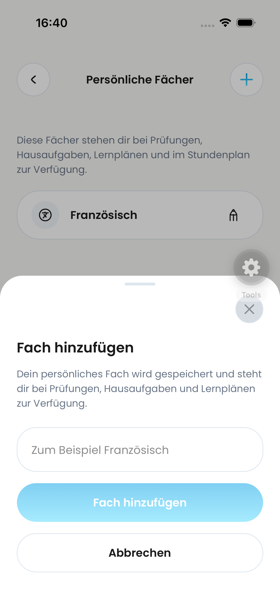</a>
<a href="verified-swipe-ios.png">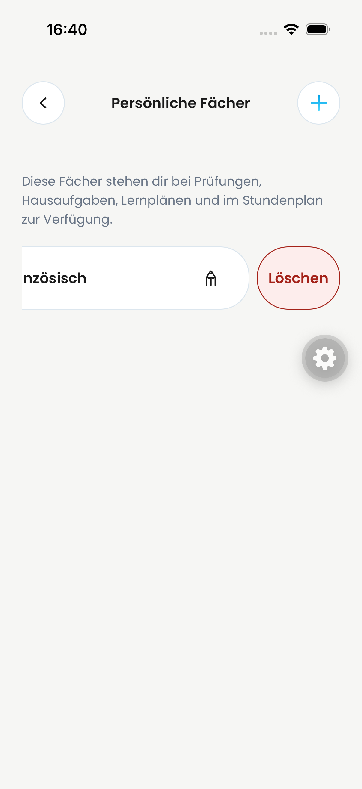</a>
<a href="verified-confirmation-ios.png">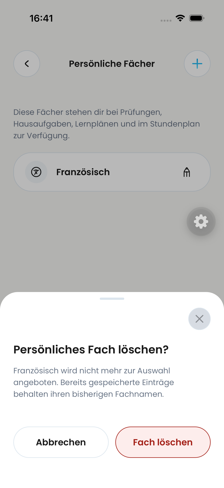</a>

### review-20260924-16.25.44.png

<a href="review-20260924-16.25.44.png">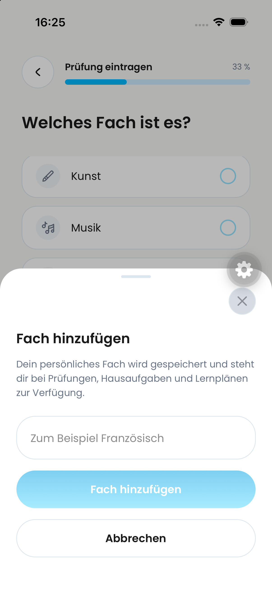</a>

### review-20260924-16.25.16.png

<a href="review-20260924-16.25.16.png">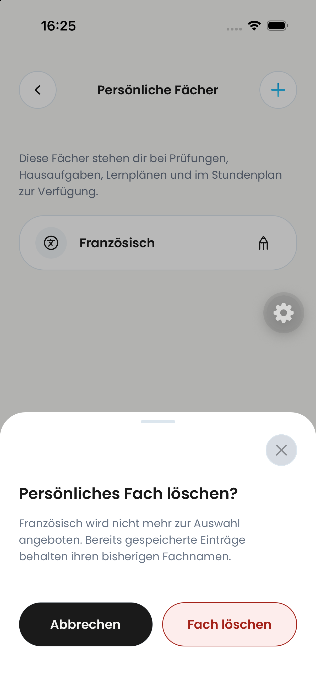</a>

### review-20260924-16.25.03.png

<a href="review-20260924-16.25.03.png">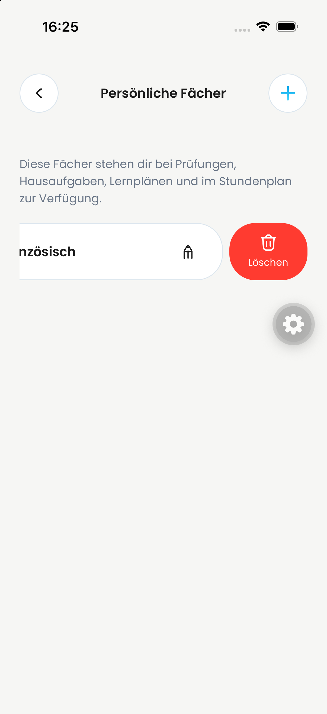</a>

### review-20260924-16.24.59.png

<a href="review-20260924-16.24.59.png">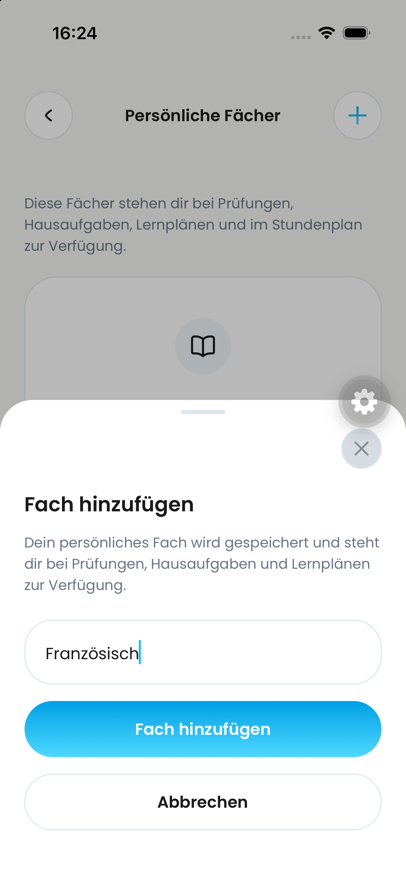</a>

### review-20260924-16.24.43.png

<a href="review-20260924-16.24.43.png">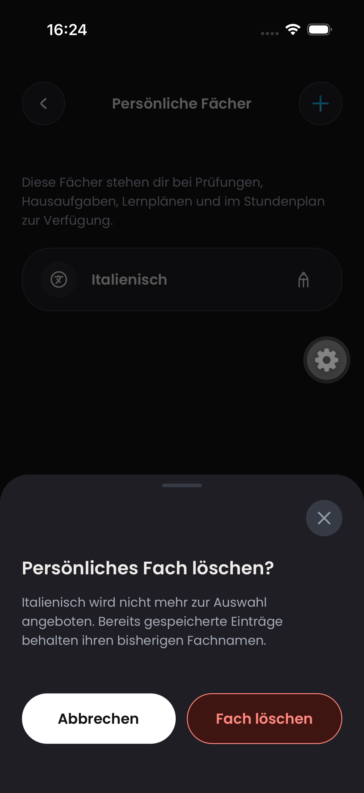</a>

### review-20260924-16.24.22.png

<a href="review-20260924-16.24.22.png">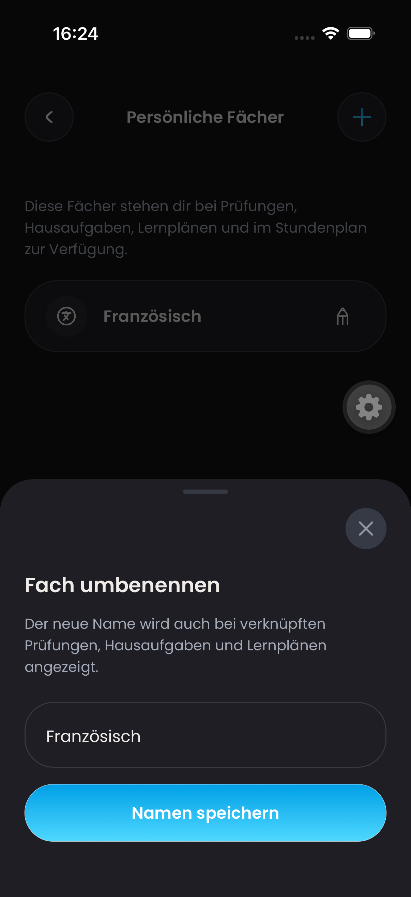</a>

### review-20260924-16.24.04.png

<a href="review-20260924-16.24.04.png">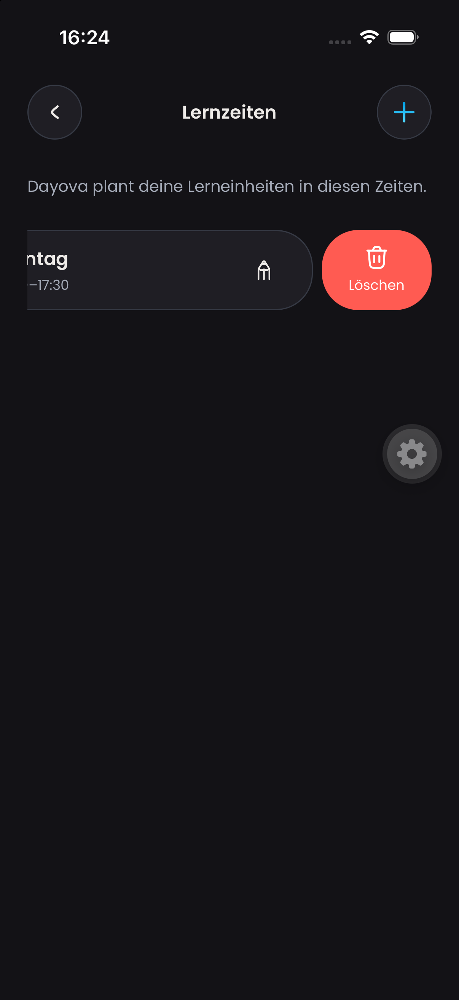</a>

### review-20260924-16.23.47.png

<a href="review-20260924-16.23.47.png">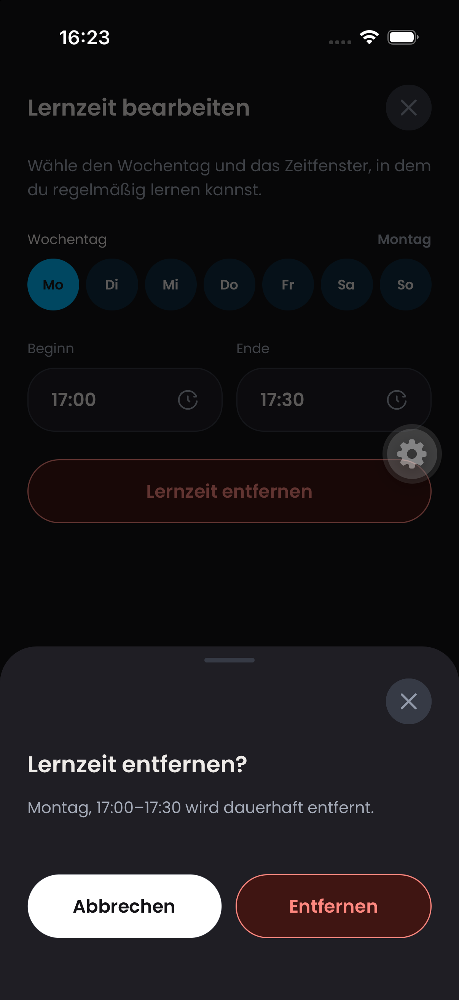</a>

### before-planning-20260923.png

### before-rename-android.png

### before-learningtime-swipe.png

<a href="before-learningtime-swipe.png">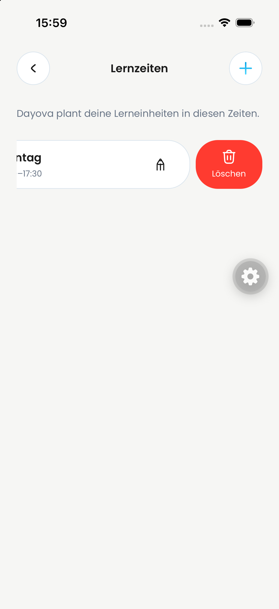</a>

### review-20260924-16.23.36.png

<a href="review-20260924-16.23.36.png">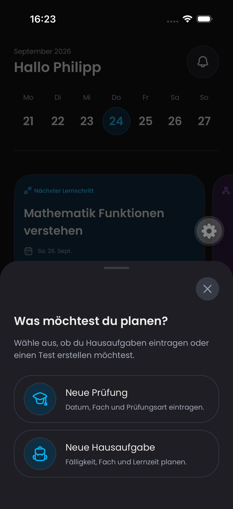</a>
