# Popup action follow-up — 24 September 2026

## Approved isolation — 1 October 2026

The shared-only layer is based on #727 (`5f294ce7`), not combined QA #728.
It retains the original cancel variant, shared confirmation cancellation,
light danger tokens and button regression tests. It does not introduce new design.

Three consumer-file changes from original commit `b9445e38` require prerequisites
absent from main/#727. They are preserved verbatim, not silently discarded:

- `subject-consumers-follow-up.patch`: personal-subject swipe and picker cancellation;
  needs the personal-subject screen from #655 and the shared button layer.
- `learning-time-consumer-follow-up.patch`: learning-time swipe deletion;
  needs the existing but not yet integrated swipe-capable learning-time screen and
  the shared button layer. The current main screen remains unchanged.

These patches are review artifacts, **not active application code or completed
consumer PRs**. Once the relevant prerequisites are merged, replay each on a scoped
branch against current main, resolve any intervening changes, validate and open
a Ready-for-Review PR. Do not apply them blindly or import combined-QA ancestry.
Philipp approved publishing this narrowed #729 as a stack layer on #727.
The consumer adaptations remain explicit follow-up work, not completed features.
No merge, deployment or fresh native evidence.

Local shared-layer validation: 2 rendered button tests and 7 theme/contrast tests
passed; TypeScript, targeted ESLint/Biome and diff check passed. Independent
standards and scope reviews found no blocking issues in this proposed split.
This does not validate the inactive consumer patches against future parents.

### Review correction: interactive destructive contrast

CodeRabbit identified that 80% group opacity reduces the original light red to
3.80:1 contrast during interaction. A failing regression reproduced this before
darkening only light `dangerAction` to `#B01B10` (matching CSS HSL). The test now
checks idle and 80%-opacity text/fill compositing over background and surface in
both themes. All 9 focused tests, TypeScript and targeted lint pass; dark tokens,
button layout and callbacks remain unchanged.

### Integration checks for Jakob

The existing EAS CI trigger targets PRs based on `main` only. This stack layer
targets #727, so a pending OTA-freshness status is not evidence of a failed app
build, nor proof of compatibility. After #727 is merged, update/rebase the stack
and validate the resulting #729 head against main with CI and the OTA report.
Do not copy the parent's report or mark pending checks as passed. This handoff
does not authorize a deployment or change the shared CI workflow.

## Historical combined-QA evidence (24 September 2026)

User-supplied original PNGs. September iPhone captures show popup spacing in QA #728 (45faaa23), BEFORE this follow-up changes the cancellation and swipe-delete buttons. Historical before images have no verified commit mapping and include different platforms/themes; not a pixel-matched comparison.

## Historical complete changes (including the deferred consumers)

- Saturated light-mode danger action (#D12013 on #FFF0EE), preserving AA label contrast; dark unchanged.
- Shared cancel variant matches the outlined card-surface appearance of Add subject. All app ConfirmationSheet cancellations use it; OS-owned picker cancellation stays native.
- Subject and learning-time swipe delete use the shared icon-free destructive Button; callbacks and confirmations unchanged.
- Popup header spacing and handle unchanged.

## Historical validation (not the isolated branch)

84 UI suites / 392 tests passed after the implementation. Added cancellation regression then re-ran 3 affected suites / 9 tests successfully. Theme contrast tests: 7 passed. TypeScript and changed-file Biome passed. No production deployment. Native visual verification is recorded separately in PR comments; these user screenshots are not evidence of the new button state.

## Original PNGs

Final automated run: **84 suites / 393 UI tests passed**.

iPhone Light native walkthrough passed: opened/cancelled Add subject, exposed
swipe delete, opened/cancelled the confirmation. No subject was deleted.
The captures below prove button shape, no trash icon, and outlined cancellation;
the server was subsequently cold-restarted to ensure refreshed CSS color tokens.
They are not an independent color-value measurement. Android, Dark and enlarged
text were not freshly visually revalidated for this follow-up.

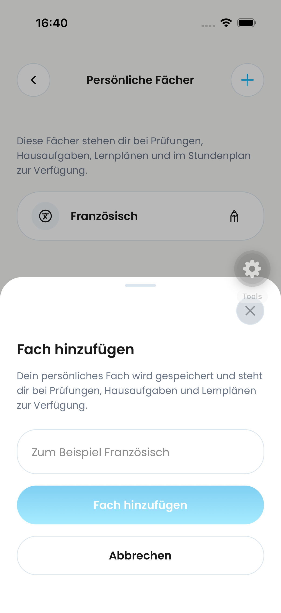
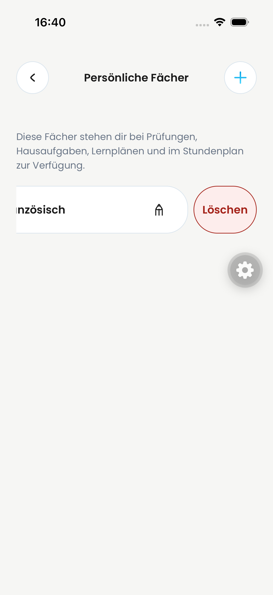
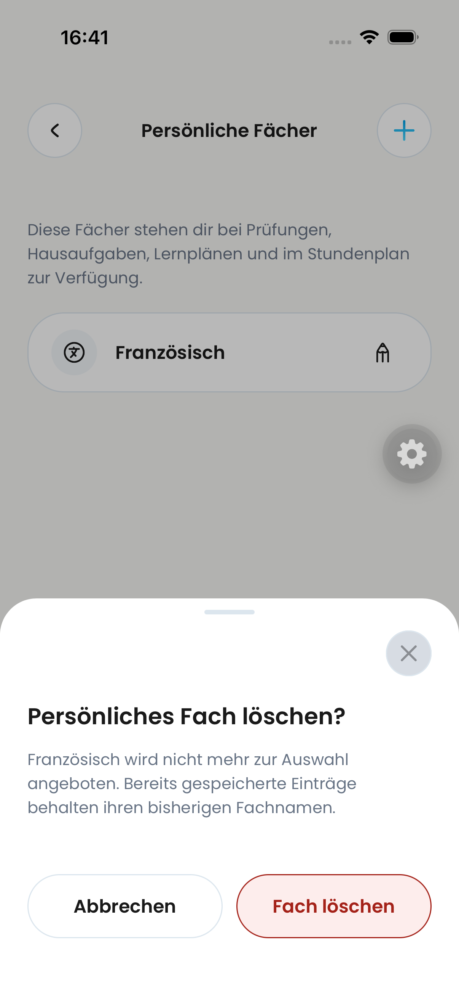

### review-20260924-16.25.44.png

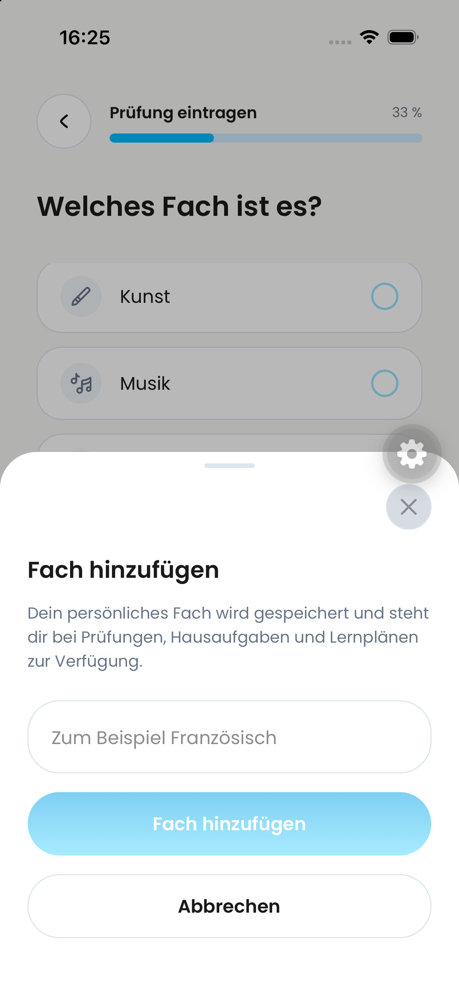

### review-20260924-16.25.16.png

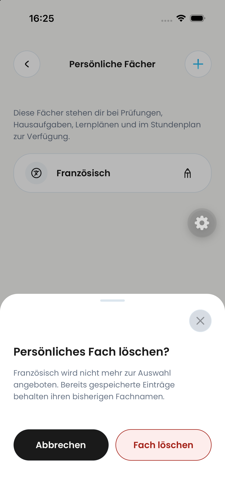

### review-20260924-16.25.03.png

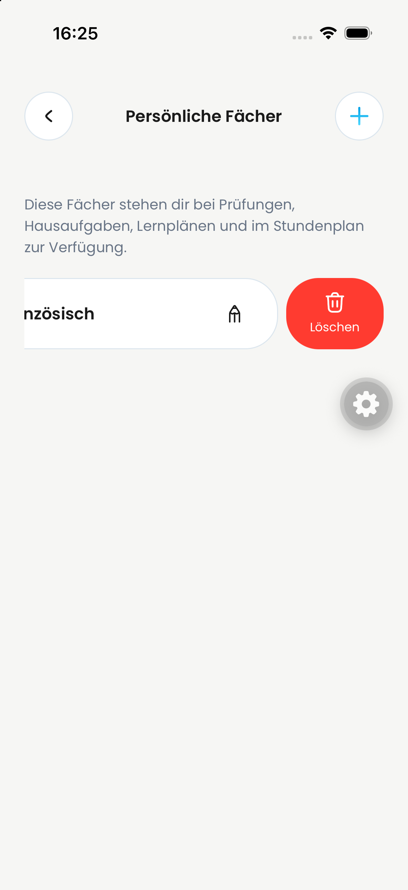

### review-20260924-16.24.59.png

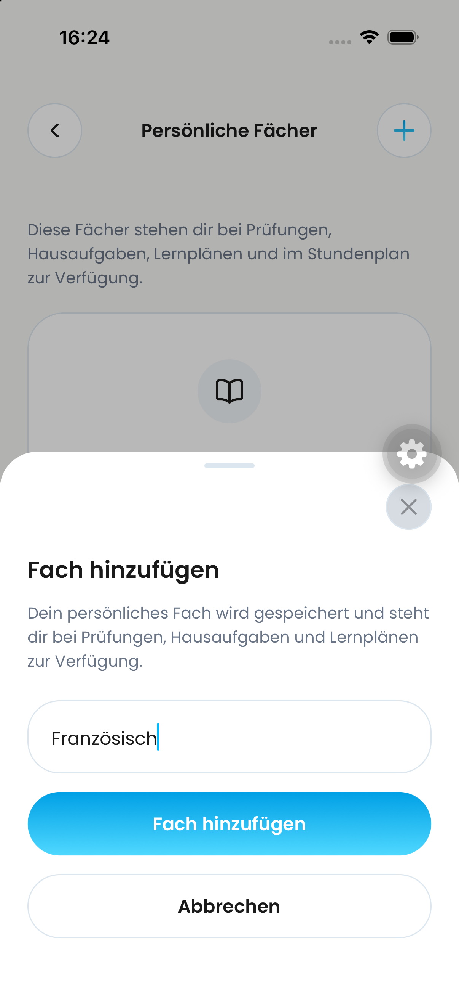

### review-20260924-16.24.43.png

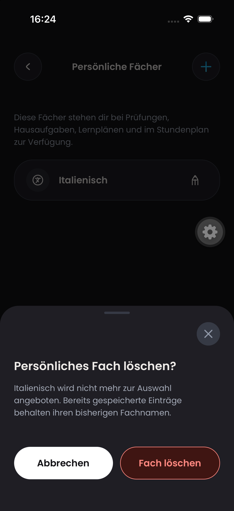

### review-20260924-16.24.22.png

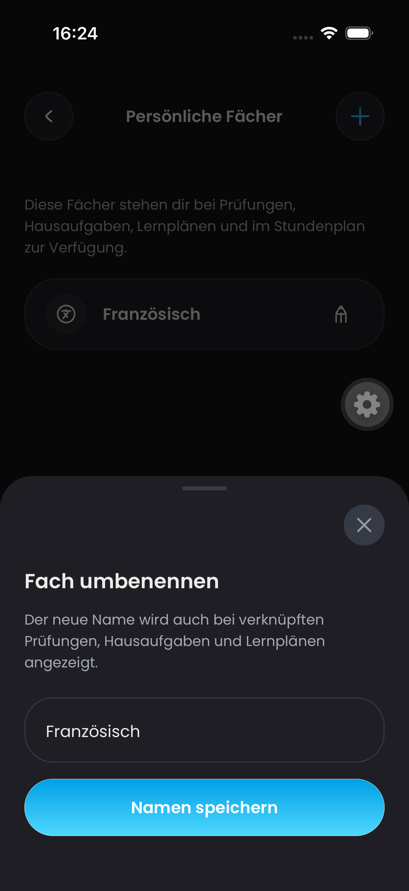

### review-20260924-16.24.04.png

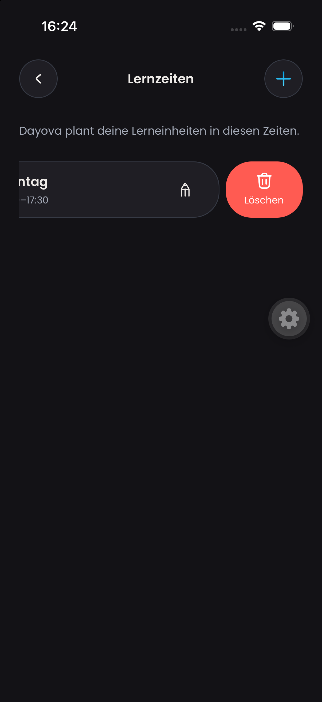

### review-20260924-16.23.47.png

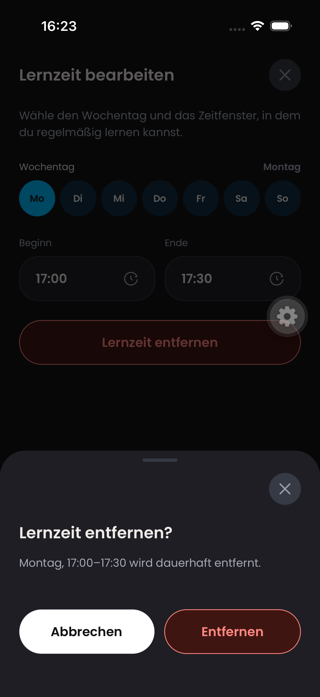

### before-planning-20260923.png

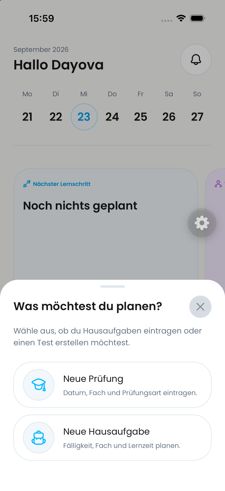

### before-rename-android.png

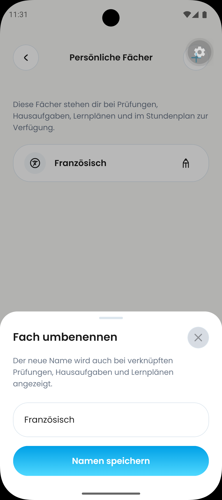

### before-learningtime-swipe.png

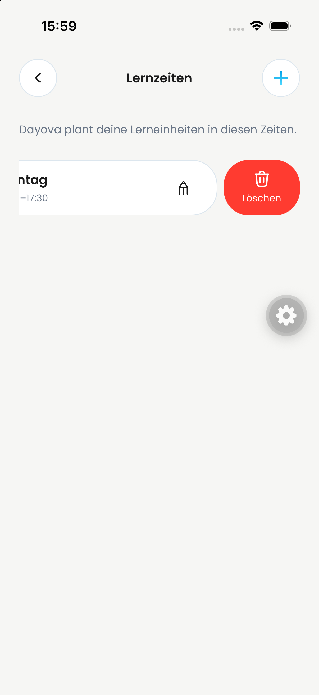

### review-20260924-16.23.36.png

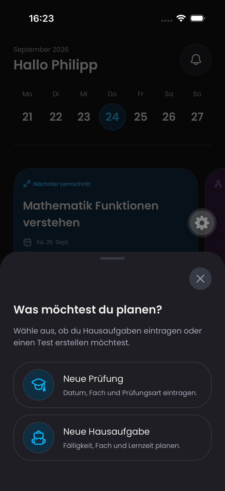
