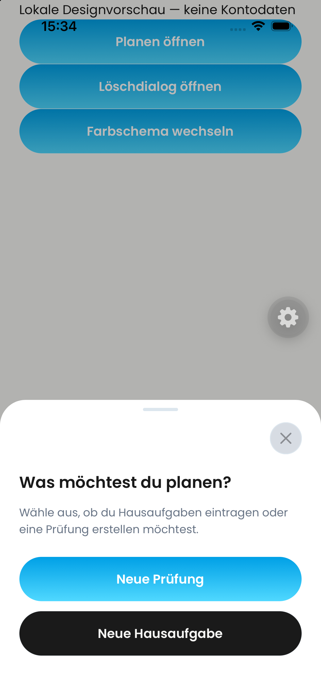
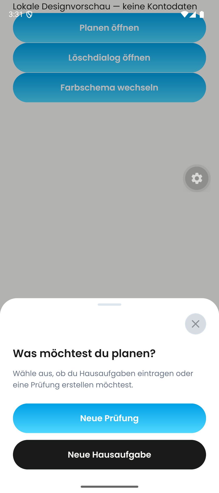
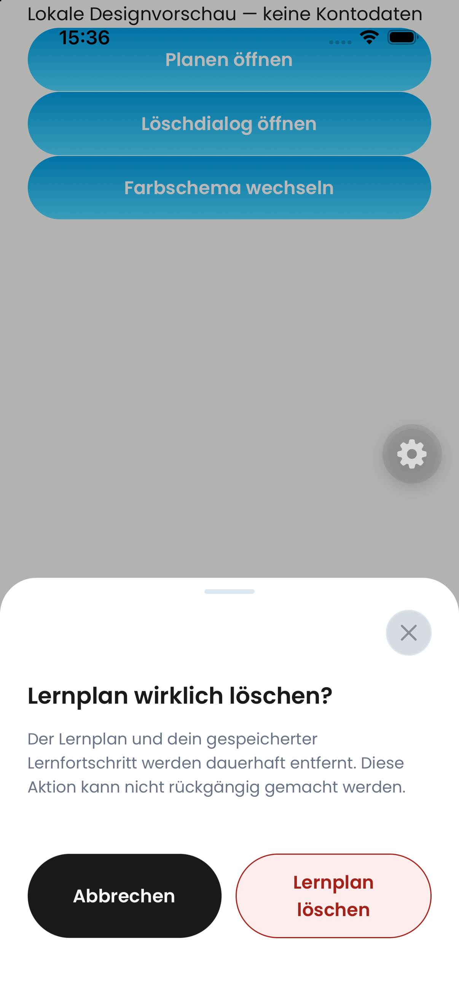
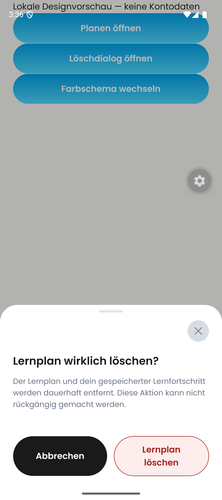

# Popup header and destructive-action design evidence

Date: 2026-09-24. Base: PR #726, `dcb4787691a3c92e7906763b53d173cd1bcfb988`.

User-approved design: close control above the full-width title, preserve the grey drag handle, use tinted/outlined red destructive pills without decorative icons. Shared tokens preserve the existing status/error colors.

## Native evidence (after)

These are actual simulator captures of the changed `DayovaSheetFrame`, `ConfirmationSheet`, and `Button` components in a temporary, backend-free gallery. The gallery used local Poppins fonts and the app's theme/safe-area/bottom-sheet providers. Its planning choices are simple fixture buttons, not the production planning-choice cards. The gallery and temporary entry-point change were removed before commit.

| iOS simulator | Android emulator |
| --- | --- |
|  |  |
|  |  |

Observed: grey handle retained; X above title; full-width title/description; red outlined, tinted delete action with readable wrapping and no icon. No real account, plan, or material was deleted. The floating gear belongs to the development environment.

## Coverage and remaining acceptance

- TypeScript and targeted ESLint/Biome checks.
- Shared-sheet tests cover separate close/title rows at font scales 1 and 2, along with existing sheet behavior tests.
- Theme unit tests enforce destructive foreground/fill contrast of at least 4.5:1 in light and dark themes.
- Targeted UI suites: shared sheet, timetable editor, paywall, profile, and material-required sheet.
- Native dark-mode and enlarged-system-font attempts did not yield usable dialog captures; they are **not** claimed as passed.
- Busy/error rendering, VoiceOver/TalkBack traversal, iPad, every individual destructive-action surface, and authenticated end-to-end delete behavior are **not** certified by these screenshots.
- No before image has been fabricated. User-provided references are design inputs, not a captured baseline build.
- Not merged or deployed; this is a stacked follow-up to #726.

## Review

The code review checked that callbacks, confirmation guards, and disabled/busy semantics remain intact, that the app entry point is restored, and that the production changes contain no fixture backend behavior. Material-card content was regrouped into an icon/name row with a separate text action to avoid collapsing the filename area.
