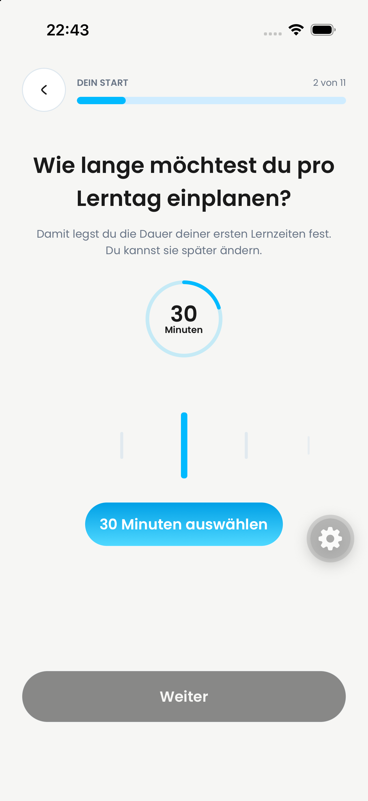
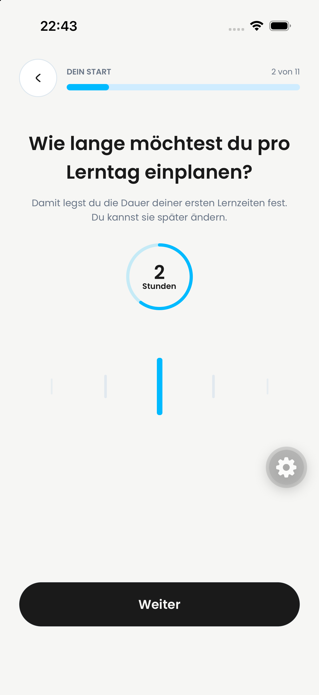
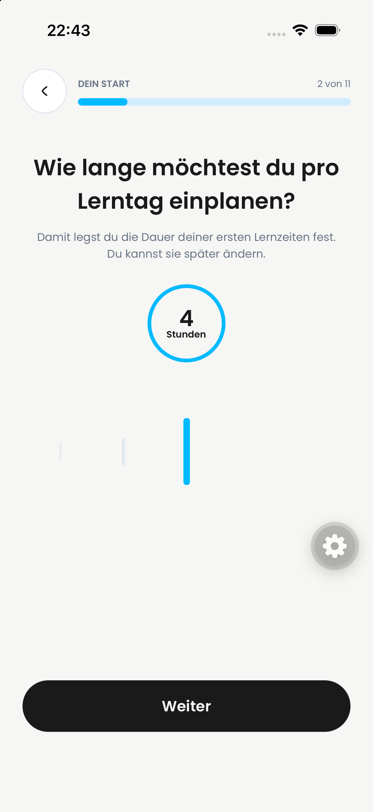

# PR #813: functional learning-time contract

Decision: Philipp's explicit approval on 2 October 2026 supersedes the earlier
#813 UI/copy expansion. Keep the pre-PR onboarding layout and sequence. No new
explanation screen, custom-duration sheet, subject UI or Settings redesign.

## Three answers

- Duration per chosen learning day: 15, 30, 45, 60, 90, 120, 150, 180, 210 or
  240 minutes in the existing carousel. No option above four hours and no free
  hours/minutes entry. Historic 10/20-minute answers remain readable; the previous
  unreleased >240-minute experiment now fails validation rather than truncating.
  Display: 15/30/45 Minuten, then 1 Stunde, 1,5 / 2 / 2,5 / 3 / 3,5 / 4 Stunden.
  Carousel preview, confirmation, recovery and summary use matching units;
  persistence remains integer minutes.
- Recurring weekdays define which days receive that duration.
- Preferred start time plus duration defines each window's exact end. Existing
  onboarding persistence and explicit confirmation remain; windows must finish
  before midnight. A failed transfer remains recoverable, never silently shorter.

Example: 60 minutes, Monday/Wednesday, 16:00 -> weekly Monday and Wednesday
16:00–17:00. This is availability, not a promise of a one-hour session or an
automatic assignment of the entire window as workload.

## Planning without personal learning times

A learner can create a learning plan without manually entering learning times.
The server and generation screen use the same effective planning windows:

| Source | Effective windows |
| --- | --- |
| At least one saved personal window, including onboarding | Only the saved windows; no filling other days with defaults |
| No personal windows, grade 5–8 | Every day 16:00–20:00 |
| No personal windows, grade 9–10 | Every day 16:00–22:00 |
| No personal windows, grade 11–13 | Every day 16:00–24:00 |
| Missing/invalid legacy grade | Conservative 16:00–20:00 fallback |

Grade 5 is included in the profile/onboarding vocabulary. Class boundaries apply
to automatic proposals, not silent truncation of explicitly chosen personal
windows. Proposals are computed, not inserted into `userLearningTimes`; Settings
therefore does not claim that the learner already chose them. The grade windows
are a product policy, not a scientific recommendation about children's bedtime.

Availability, initial plan generation and rolling follow-up scheduling share
`getPlanningLearningTimes`. Existing occupied appointments and active timetable
lessons still block collisions. Only future time before the exam is usable;
today's already-started window contributes its remaining free portion. Real
capacity exhaustion remains an honest error, not a reason to invent overlapping
appointments or guarantee that every exam can still be prepared for.

The existing school-material and scope-confirmation requirements remain.
There is no behavior-derived routine model, check-in popup, automatic inference
from actual study starts or new notification scheduling in this PR.

## After the Wissenscheck

Job: invite a learner with no personal windows to choose suitable times.
Hierarchy: completion/result first, optional explanation second, existing primary
return-to-plan action remains available. A centered, subtle light-blue card uses
the existing system-subtle token. No automatic modal and no forced setup.

The entire pre-plan “Ist genug Lernzeit eingeplant?” screen is removed, including
its availability request and gating. Exam date continues directly to topics.
Returning from topics returns to the date without creating a second exam.
Actual scheduling still protects against collisions; that is not a setup screen.

Copy:

> Wann passt Lernen in deinen Alltag?
>
> Feste Lernzeiten helfen dir, regelmäßig anzufangen. Wenn du an mehreren Tagen
> lernst, kannst du dir den Stoff besser merken. Wähle Zeiten, die zu deinem
> Alltag passen.

Optional action: **Lernzeiten jetzt eintragen**. It first persists session completion,
then opens a sheet on the completion screen, reusing the learning-time day/time
fields. Only Save writes a learning window; closing leaves completion available.
Errors remain in the sheet and allow retry. “Zum Lernplan” remains available.
The hint is absent with even one saved time and while the query loads;
query failure hides only the optional hint. It is shown after diagnostic sessions,
not after ordinary theory/practice. No account-wide reminder frequency is invented.

The behavioral adaptation discussed in earlier meeting notes is deliberately out
of scope. Context: [Lernzeiten discussion](https://app.notion.com/p/3e92e87228bf80cf9294d9c14b535a12)
and [Notifications/Lernzeiten](https://app.notion.com/p/3ed2e87228bf8080b7bfea236d46efd6).

## Research basis and limits

- [Gollwitzer & Brandstätter (1997), Implementation Intentions and Effective Goal Pursuit](https://www.socmot.uni-konstanz.de/publications/implementation-intentions-and-effective-goal-pursuit):
  specifying when/where to act can support starting goal-directed action. This
  supports the modest first sentence, not a guaranteed school-grade improvement.
- [Dunlosky et al. (2013), Improving Students' Learning With Effective Learning Techniques](https://journals.sagepub.com/doi/10.1177/1529100612453266):
  distributed practice supports retention; regular clock times alone are not the
  same as spaced practice. The copy therefore explicitly recommends several days.

No Harvard attribution, invented percentage or promise of faster success.

## Acceptance sheet

Record simulator/build/commit and mark each row passed, failed or not tested.
Automated results and actual native evidence are reported separately below.

| Check | Expected |
| --- | --- |
| Registration duration | Existing carousel starts at 15 and ends at 240 minutes; no >4h option or hours/minutes sheet |
| Duration selection | No answer manufactured merely by opening the screen |
| Days/time/summary | 60 min + Monday/Wednesday + 16:00 yields two exact 16–17 windows |
| Boundary | Late start plus duration reaching midnight rejected visibly, never silently shortened |
| No personal times | Plan creation proceeds using grade proposals; Settings still empty |
| Grades 5/8, 9/10, 11/13 | End bounds 20, 22, 24; no overlap with existing school/events |
| Today after 16:00 | Remaining window remains usable before tomorrow's exam |
| Explicit personal times | Override proposals, including chosen days; other owners' times never leak |
| Wissenscheck complete, no times | Benefit explanation and voluntary action; Zum Lernplan still usable |
| Reminder action | Completion saved before opening the inline day/time sheet; closing returns to completion, Save persists the window |
| Time picker | Editor dismisses before the wheel opens; closing the wheel restores the draft |
| Reminder loading/query error | Completion screen remains usable |
| Times already saved | No reminder |

Follow-up validation (removal of availability screen and inline reminder):
369 Jest UI tests, 963 Vitest tests, TypeScript and scoped ESLint passed.
Native end-to-end Wissenscheck acceptance remains open: the earlier simulator run
stopped at school-material upload, before the completion screen. These automated
results do not certify the new native sheet/clock interaction.
| Routine | No daily check-in or behavior-derived schedule popup |

## Verification

### User-provided after screenshots, 2 October 2026, 22:43

Philipp supplied four unmodified screenshots from “Dayova Jakob Review iPhone”.
They show onboarding step 2 of 11: 30 Minuten (preview with disabled Weiter),
then 2, 3 and 4 Stunden (with enabled Weiter). These are after-state still images,
not a before/after comparison or proof of persistence, transition behavior or the
complete Wissenscheck flow. The images contain no visible account details.

| 30 Minuten | 2 Stunden | 3 Stunden | 4 Stunden |
| --- | --- | --- | --- |
|  |  |  |  |

### Automated verification

- Full Vitest run: 130 files, 963 tests passed.
- Full Jest UI run: 80 suites, 357 tests passed.
- TypeScript, scoped ESLint/Biome and whitespace checks passed.
- Independent Standards and Spec reviews completed. Follow-up regressions cover
  initial and rolling planning without saved times, today's remaining window,
  and failure isolation for the optional reminder.
- Native inspection is tracked separately in the PR; automated checks are not
  a claim that every acceptance-sheet row has passed on a device.

No production deployment or merge authorization is implied. #817 remains a
separate child PR; #816 is unchanged.
