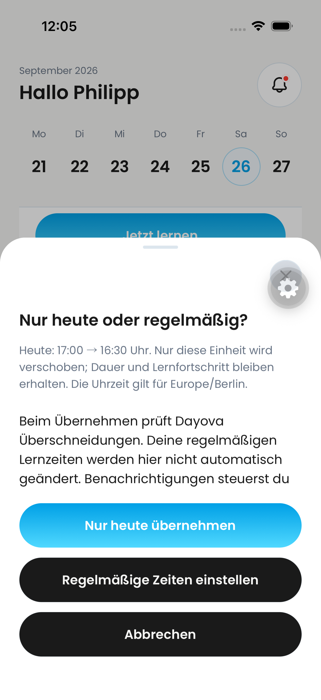
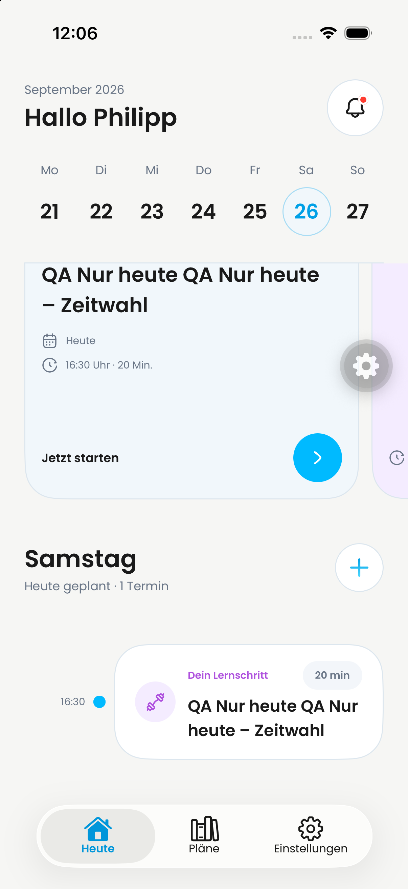
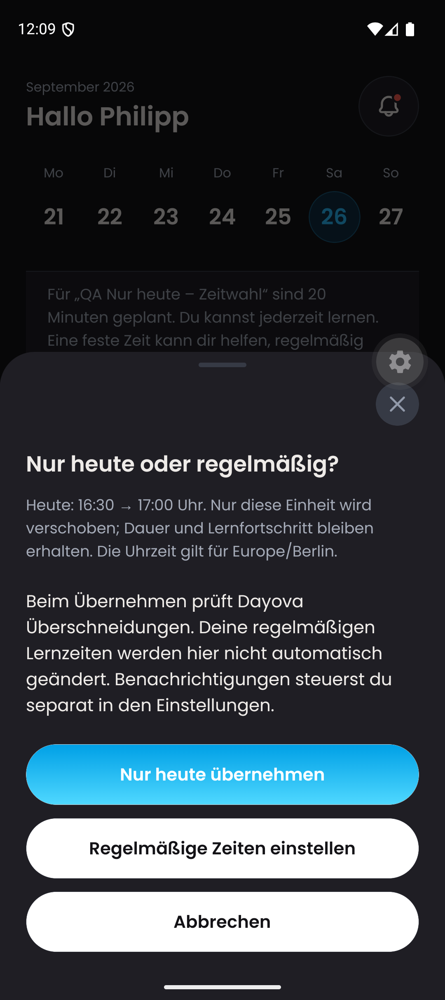
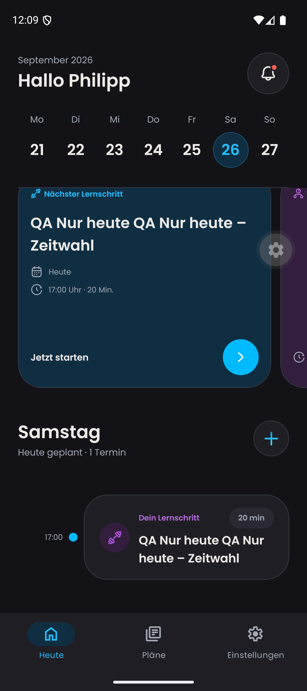

# Native routine confirmation handoff

Combined QA client, based on #760 (`be6d76e2`) plus this scoped handoff fix.
Metro 8092; dev backend `trustworthy-skunk-257`. No production deployment.

## Defect and fix

On iPhone, confirming the native time picker dismissed the following consent
sheet during the picker-to-sheet transition. Reproduction: the 11:59 native run
could select a time but never reached `Nur heute übernehmen`. The follow-up
dialog now opens after the picker dismissal callback, not during dismissal.
Android reports dismissal after the native picker unmounts.

## Observations (26 September 2026, Europe/Berlin)

- iPhone 12:05: preview 17:00 → 16:30; cancel preserved 17:00; reopen and explicit
  consent saved 16:30. Backend and calendar confirmed 20 minutes, not started.
  The original script's final assertion expected the coach to reappear and
  failed: the product intentionally dismisses it for today after success.
  The checked-in script corrects that assertion; it is not claimed as a full
  rerun. Native run: `2026-09-26_120502`.
- Android 12:09: 16:30 → 17:00 consent completed, and the coach disappeared.
  Complete Maestro run passed: `2026-09-26_120845`.
- Android AlarmManager before/after: today's Dayova alarms changed from
  **16:15 and 17:05** to **16:45 and 17:35**; the old times were absent after
  the change. This proves OS scheduling reconciliation, not later delivery.
- iPhone push switch was off while the move succeeded. iOS native scheduled
  notifications and eventual delivery remain unverified.

Fixture `qa-native-only-today-20260926` creates one new plan/session/calendar
entry only. A separate date-limited internal replay resets only the known QA
account's daily prompt dismissal for the second platform. Existing sessions,
answers and recurring times are not reset. Do not count synthetic data as
organic learning history.

## Automated checks

6 rendered UI tests; 16 routine/notification tests; 9 fixture tests passed.
TypeScript and targeted ESLint passed. No source-text assertions substitute
for the native observations above.

## Screenshots

Still images only; no recording or full product-quality acceptance is claimed.
