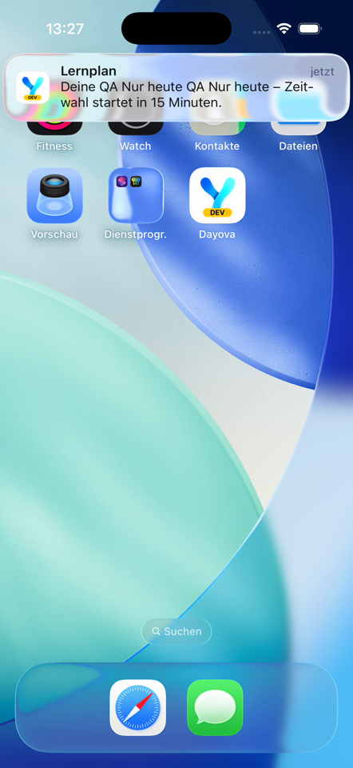
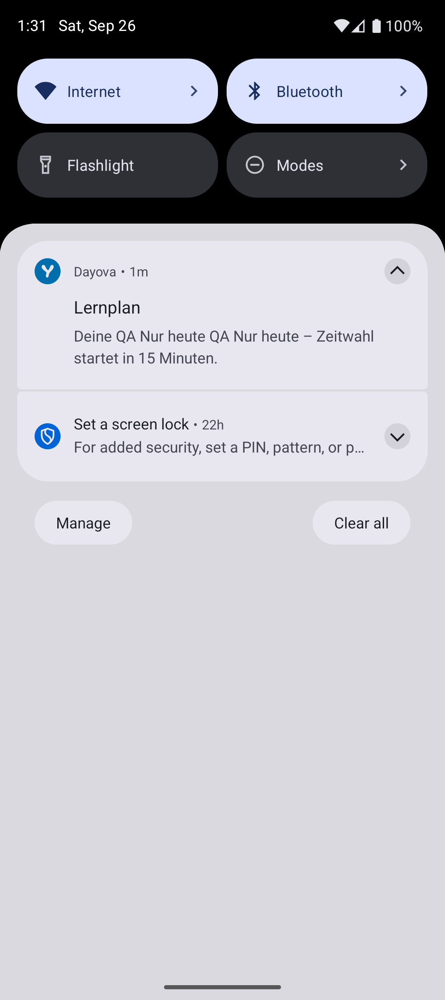
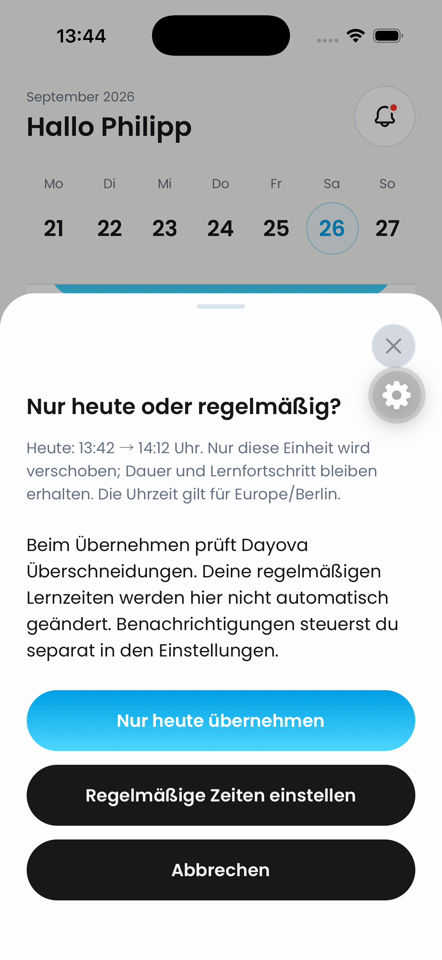

# Background reminder delivery — 26 September 2026

QA only; frontend `c72315c2`, existing iOS 26.4 and Android API 36 development clients,
Metro 8092, backend `dev:trustworthy-skunk-257`. No production changes.

## Observed delivery

The existing synthetic `QA Nur heute` session was moved from 16:30 to 13:42
through `learningPlans:moveSessionToday`, using the QA identity and the current
optimistic-concurrency timestamp. This is notification testing, not evidence of
a native picker interaction. Both clients synchronized, then the apps were put
in the background without force-stopping them.

- iOS scheduled identifier `85583dec-4e42-4d6d-82f6-c3de50edfa92` for 13:27.
  The same identifier subsequently appeared in native DeliveredNotifications.
  The recording visibly shows the banner at 02:16.972–02:22.045 (13:27 CEST),
  with Dayova remaining in the background. No second banner is visible in the
  inspected samples through the end of the recording.
- Android scheduled 13:27 with a 2m55.514s inexact-alarm window. The notification
  was posted at 13:29:55.769 CEST (`when=1790422195769`), with tag
  `ebe72040-4a8c-4623-89f9-c53318b276b8`. The original alarm was no longer pending.
  Opening the notification shade showed the expected QA reminder. This is
  observed delivery with about three minutes of delay, not exact-minute delivery.

[Unedited iOS delivery recording](ios-delivery.mp4).

## Video coverage

Coverage: 202.92-second video; 82 full-timeline frames sampled at 0.394241 fps (2.536521-second interval); 6 contact sheet(s); no audio stream.

All six full-timeline sheets were inspected. This is sampled coverage, not a
frame-by-frame audit; short intervening events are not ruled out. No sound or
locked-screen behavior is claimed. Android delivery here is supported by the
system record and still image, not a completed video-inspection claim.

## Additional finding and remaining limits

## Fresh iOS later-selection replay

On the same frontend `c72315c2`, the centered Maestro flow passed twice:
`Lieber später` → `Auswahl prüfen` → `Nur heute übernehmen` → `Abbrechen`.
The test cancels; it does not claim to apply a new time. In the unedited recording,
the picker is visible at 00:21–00:22.5, consent at 00:24–00:25.5, and the
dashboard returns at 00:26 with the original 13:42 entry.

[Unedited later-selection recording](ios-later-consent.mp4).

Coverage: 29.45-second video; 59 full-timeline frames sampled at 2 fps (0.5-second interval); 4 contact sheet(s); no audio stream.

All four sheets and the consent frame were inspected. Sub-half-second events
and sound are not covered. Earlier failed attempts were contaminated by a
development warning over the picker button and a navigation-bar hit during
scrolling. They are not accepted as proof of a product regression. The parent
recording from the first attempt has the same warning contamination. A later
[parent retest](README.md#parent-comparison-and-review-qualification) also
reached consent. It is not a deterministic failing-before/passing-after pair.

### Separate notification reconciliation finding

After opening the parent build for the subsequent comparison, the client logged
`notifications:recordDeliveredNotification` → `Ungültige Mitteilung` at the
backend timestamp validation. Subsequently reproduced and fixed separately in
[#762](https://github.com/Dayova/dayova-mvp/pull/762): iOS provides seconds,
Android milliseconds. The isolated regression and full 902-test suite pass.
Reopening both clients on combined source `e601a45e` (Metro 8093) produced four
successful reconciliation calls. See the
[timestamp verification report](https://github.com/Dayova/dayova-mvp/blob/59184de1/docs/qa/notification-timestamp-2026-09-26.md).
The original delivery screenshots alone were not used to accept reconciliation.

The QA session remains at 13:42, unstarted. No completed progress was reset.
These observations do not prove absence of a duplicate at all former future
times, nor a full acceptance of every integrated PR.
