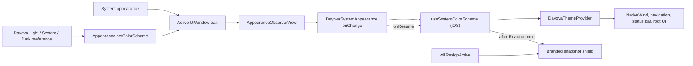

# Dayova System Appearance

`dayova-system-appearance` is a local, iOS-only Expo module that reports the
resolved appearance of Dayova's active `UIWindow` to JavaScript, emits an event
when that appearance changes, and prevents iOS from presenting stale theme
content from its saved background snapshot.

It is a narrow compatibility layer for the appearance synchronization problem
observed while validating the Expo SDK 57 / React Native 0.86 upgrade. It is
not Dayova's theme system, it is not a reusable public package, and it should be
removed when the standard React Native appearance path is reliable for Dayova
again.

| Property | Value |
| --- | --- |
| Status | Active compatibility workaround |
| Scope | Dayova iOS application only |
| Current native baseline | Expo SDK 57, React Native 0.86, module target iOS 16.4 |
| Review trigger | Every Expo SDK, React Native, or minimum-iOS upgrade |
| Exit condition | React Native's public appearance API passes the complete Dayova iOS validation matrix without this module |
| Decision record | [`docs/contexts/mobile-app/adr/0001-use-local-ios-system-appearance-bridge.md`](../../docs/contexts/mobile-app/adr/0001-use-local-ios-system-appearance-bridge.md) |

## Executive summary

Dayova supports three user preferences: Light, System, and Dark. The app needs
one resolved `"light" | "dark"` value to keep all of these layers aligned:

- NativeWind variables and mounted Fabric views
- React Navigation colors
- Dayova's JavaScript theme context
- UIKit controls and native sheets
- the status bar and root background

The standard solution is Expo's `userInterfaceStyle: "automatic"` together
with React Native's `Appearance` / `useColorScheme`. During native validation
of React Native 0.86 on the installed iOS 26.5 simulator, React Native's
appearance value was stale during cold launch and live system appearance
changes even though the key `UIWindow` had the correct UIKit trait. Depending
on the stale value made different layers of the app disagree about the current
theme.

This module closes that gap by reading the key window's
`traitCollection.userInterfaceStyle` directly, observing that trait on a view
attached to the window, and exposing the result through a small Expo Modules
API. It also nudges React Native's native `RCTAppearance` implementation to
resolve appearance from the key window during initialization and foreground
resumption. Before iOS backgrounds Dayova, the module covers the app with a
stable branded snapshot shield. It removes that shield only after the resumed
React tree has committed the refreshed appearance.

The problem was observed on a specific upgraded native stack. The existence of
this workaround should not be interpreted as a claim that every React Native
0.86 application, iOS version, or simulator has the same problem.

The architecture rationale, source-level diagnosis, decision history,
alternatives, and consequences live in the
[mobile-app ADR](../../docs/contexts/mobile-app/adr/0001-use-local-ios-system-appearance-bridge.md).

## Why a native module is necessary

JavaScript can normally read the native color scheme through React Native:

```ts
import { useColorScheme } from "react-native";
```

That hook subscribes to React Native's native `Appearance` module. It does not
independently inspect the active UIKit window. NativeWind's color-scheme hook
also ultimately uses the React Native appearance APIs on native platforms.
When the React Native value is stale, adding another JavaScript wrapper around
it preserves the same stale source.

The value that behaved correctly during the iOS investigation was the active
window's UIKit trait. Reading and observing `UIWindow.traitCollection` requires
native iOS code, so some form of native bridge was required if Dayova was to
retain its System preference and react immediately to live changes.

## Scope and non-goals

The module is responsible for:

- synchronously returning the resolved appearance of the active iOS window;
- emitting `onChange` when that window changes between light and dark;
- refreshing the value when the app becomes active;
- making React Native resolve system appearance from the key window;
- owning the native snapshot shield and its resume handshake; and
- installing and removing its UIKit observer with the JavaScript listener
  lifecycle.

The module is deliberately **not** responsible for:

- storing the learner's Light, System, or Dark preference;
- deciding which preference wins;
- setting Dayova colors, CSS variables, or NativeWind variables;
- configuring React Navigation or the status bar;
- changing the device's system-wide appearance;
- Android or web appearance handling; or
- publishing a standalone npm package.

Those responsibilities remain in the application layer:

- [`src/lib/theme-preference.ts`](../../src/lib/theme-preference.ts) defines and
  resolves the preference model.
- [`src/lib/theme.ts`](../../src/lib/theme.ts) stores the preference and applies
  the app-level native override with `Appearance.setColorScheme`.
- [`src/lib/system-color-scheme.ios.ts`](../../src/lib/system-color-scheme.ios.ts)
  adapts this module to the application.
- [`src/lib/system-color-scheme.ts`](../../src/lib/system-color-scheme.ts) keeps
  Android and other platforms on React Native's standard `useColorScheme` path.
- [`src/app/_layout.tsx`](../../src/app/_layout.tsx) applies resolved NativeWind
  variables and native root background behavior.
- [`src/components/ui/themed-status-bar.tsx`](../../src/components/ui/themed-status-bar.tsx)
  derives status-bar content color from the Dayova theme context.

## Data flow



When the preference is `"system"`, the theme provider passes `"unspecified"`
to `Appearance.setColorScheme`, which removes the app-level override and lets
the window follow iOS. Light and Dark set explicit app-level overrides. Either
path ultimately changes the window trait observed by this module.

The module also has a secondary synchronization path for React Native itself:

1. On module creation, it enables React Native's key-window appearance mode
   through `RCTUseKeyWindowForSystemStyle(true)`.
2. It posts `RCTUserInterfaceStyleDidChangeNotification` after creation and
   whenever the app becomes active.
3. React Native's `RCTAppearance` handles that notification and re-resolves its
   value from the key window.

The Dayova-specific `onChange` event remains the authoritative input for the
iOS application hook. React Native's own hosting views can also post their
normal appearance notifications during live trait changes.

## JavaScript API

The native contract intentionally has two methods and two events.

### `getColorScheme()`

```ts
getColorScheme(): "light" | "dark";
```

Returns the current appearance of the active iOS window synchronously. UIKit
access is performed on the main queue. If there is no active window, the module
falls back to `UITraitCollection.current`. Any non-dark value is normalized to
`"light"`, so consumers never need to handle `null` or `"unspecified"`.

### `onChange`

```ts
type ColorSchemeChangeEvent = {
  colorScheme: "light" | "dark";
};
```

Subscribe with the Expo Modules listener API:

```ts
const subscription = DayovaSystemAppearance.addListener(
  "onChange",
  ({ colorScheme }) => {
    // Update an idempotent appearance state consumer.
  },
);

subscription.remove();
```

Application code should normally use `useSystemColorScheme` from
[`src/lib/system-color-scheme`](../../src/lib/system-color-scheme.ts) rather
than importing this module directly. The platform-specific file keeps this
iOS-only native dependency out of Android and web bundles.

The iOS hook adapts the module with React's `useSyncExternalStore`. Native
events invalidate the snapshot; `getColorScheme()` remains the state source.
React therefore rechecks the snapshot after subscribing and cannot miss a
change that lands between render and listener installation.

The module provides no setter. Theme overrides belong to React Native's public
`Appearance.setColorScheme` API and the Dayova theme provider.

### Snapshot-shield handshake

`onResume` is a lifecycle acknowledgement event, not appearance state. After
receiving it, the iOS hook forces a React commit, reads the current native
snapshot through `useSyncExternalStore`, and calls
`releaseSnapshotShield(generation)` from an effect. Native code accepts the
release only if that generation still owns the active shield, so a delayed
acknowledgement cannot remove a newer shield during rapid lifecycle changes.
This ordering keeps the shield in place until the resumed theme has actually
reached React, including resumes where the resolved Light/Dark value did not
change.

The bridge contract is:

```ts
type SnapshotShieldResumeEvent = {
  generation: number;
};

releaseSnapshotShield(generation: number): void;
```

The `generation` in `onResume` identifies the shield created for that lifecycle
cycle. Although `releaseSnapshotShield` is exported by the native bridge, it is
an adapter-internal method rather than a feature-level public API.

Application features must not call `releaseSnapshotShield(generation)`
directly. The platform adapter owns the handshake so a feature cannot reveal
the stale iOS snapshot by releasing the cover too early.

## Native implementation

### Active-window selection

`activeWindow()` gathers the windows from connected `UIWindowScene` instances,
then selects the key window and falls back to the first available window. This
matches Dayova's current single-window application model.

If Dayova later supports multiple simultaneous scenes, this selection policy
must be revisited. A process-wide "first key window" may not represent the
scene containing the React surface that requested the value.

### Trait observation

The module installs a non-interactive `AppearanceObserverView` as a child of
the active window when the first `onChange` listener attaches. Attaching the
view to the real window gives it the same trait environment as the app UI.

The observer compares color appearance before emitting. Unrelated trait
changes, such as size-class changes, do not produce a Dayova appearance event.

The implementation uses the API appropriate for the deployment target:

- iOS 17 and newer use `registerForTraitChanges`, scoped specifically to
  `UITraitUserInterfaceStyle`.
- iOS 16.4 through 16.x use `traitCollectionDidChange` and perform the same
  color-appearance comparison.

Apple deprecated `traitCollectionDidChange` in favor of trait registration on
newer iOS versions, which is why the fallback is availability-gated rather
than used everywhere.

### Listener and app lifecycle

- `OnStartObserving("onChange")` installs the view and immediately emits the
  current value.
- `OnStopObserving("onChange")` removes the view after the final listener is
  removed.
- `OnAppBecomesActive` verifies that the observer is attached to the current
  active window, reinstalls it when the first subscription happened before a
  window existed or the active window changed, and then refreshes React
  Native's appearance state. It emits `onResume` only after that refresh so the
  React adapter can commit and release the snapshot shield. This covers both
  startup ordering and a system change made while Dayova was in the background.
- `UIApplication.willResignActiveNotification` installs a full-window branded
  shield before iOS captures Dayova's background snapshot. The shield does not
  accept touches, is hidden from accessibility, and remains stable across Light
  and Dark so the saved snapshot cannot contain the previous theme.
- `OnDestroy` removes the observer and shield views, unregisters the lifecycle
  notification, and releases their references.

Appearance events can repeat around initialization or foreground activation.
Consumers must treat them as state updates, not one-time commands.

All UIKit work is marshalled to the main queue. The synchronous getter checks
whether it is already on the main thread before using `DispatchQueue.main.sync`
to avoid self-deadlock.

### React Native coupling

The module depends on `React-Core` for `RCTUseKeyWindowForSystemStyle` and the
`RCTUserInterfaceStyleDidChangeNotification` behavior. These are native React
Native implementation surfaces, not part of the documented JavaScript
`Appearance` contract. They are the most upgrade-sensitive part of the module.

Do not assume that a successful Swift compile alone proves this synchronization
still works after a React Native upgrade. Confirm the relevant declarations and
notification handling in the installed React Native source, then repeat the
runtime appearance matrix below.

## Expo registration and native-project generation

This is a local Expo module. `expo-module.config.json` declares the iOS platform
and the `DayovaSystemAppearanceModule` Swift class. Expo Autolinking discovers
local modules from `./modules` by default and exposes the pod to CocoaPods when
the iOS project is generated or synchronized.

There is no manual registration in `AppDelegate`, no custom config plugin, and
no checked-in Xcode-project edit. The repository uses Expo continuous native
generation, so native changes must remain expressible through the module,
podspec, Expo configuration, and installed packages.

After changing native code, rebuild the native app. Reloading Metro is not
enough, and the module is not available in Expo Go.

The module podspec targets iOS 16.4 to match Expo SDK 57's support baseline.
The generated Dayova application currently targets iOS 17 because
`@clerk/expo` independently requires and writes iOS 17 during prebuild. The
module does not cause that app-wide minimum.

## Known limitations and risks

- **React Native implementation coupling:** The key-window function and native
  notification behavior can change without a JavaScript API deprecation.
- **Single-window assumption:** The active-window lookup is not scene-specific.
- **Observer installation timing:** Installation requires a window to exist
  when the first listener attaches. The current hook mounts inside the running
  app UI; a future earlier consumer must verify this assumption.
- **Normalized result:** The API intentionally collapses unknown or unspecified
  UIKit values to `"light"`.
- **Duplicate state events:** Initialization, trait change, and foreground
  refreshes can report the same value. Current React state consumers are
  idempotent.
- **Intentional transition cover:** iOS can briefly show the solid Dayova
  snapshot shield during app-switcher transitions. It is intentionally kept
  until React acknowledges a resumed commit; a native timeout or immediate
  activation removal would reintroduce the stale-theme race.
- **Runtime coverage:** The module compiles with an iOS 16.4 deployment target,
  but the app's Clerk dependency currently prevents an end-to-end iOS 16.4
  launch. Compatibility at that OS floor is therefore compile-validated, not
  runtime-validated.
- **No Android implementation:** The observed defect and workaround are iOS
  specific. Android continues to use the standard React Native hook.

## Validation

### Automated checks

Run the focused source-shape regression tests:

```sh
pnpm test src/lib/ios-appearance-module.test.ts
```

These tests only assert that the podspec contains the iOS 16.4 target and that
the Swift/TypeScript sources retain the expected modern and legacy observer,
snapshot-shield, and commit-handshake markers and control-flow order. They do
not compile Swift, execute UIKit, prove callback reachability, or validate event
delivery. Native Debug/Release builds and the runtime smoke-test matrix remain
the behavioral evidence.

Confirm Expo can discover the module:

```sh
pnpm exec expo-modules-autolinking resolve --platform apple
```

The output must include:

- package `dayova-system-appearance`;
- pod `DayovaSystemAppearance`; and
- class `DayovaSystemAppearanceModule`.

For changes that affect native behavior, also run the repository validation
suite and regenerate/synchronize iOS through the established Expo workflow:

```sh
pnpm install --frozen-lockfile
pnpm check
pnpm test
pnpm check:unused
npx --yes expo-doctor@latest
pnpm exec expo install --check
pnpm exec expo prebuild --platform ios
```

Use `expo prebuild --clean` only for an intentional clean CNG verification
after confirming that the working tree and Expo configuration contain every
native customization that must be preserved.

### Native smoke-test matrix

At minimum, validate a current iPhone simulator in both Debug and a
production-style Release build:

1. Cold-launch with iOS already set to Light, then already set to Dark.
2. Select Dayova Light, Dark, and System and confirm the complete app changes.
3. With System selected and Dayova foregrounded, change iOS Light to Dark and
   back without restarting the app.
4. Background Dayova, change the system appearance, and foreground it again.
5. In Dark, force-stop and cold-launch Dayova. Confirm the native splash is dark
   in both Debug and Release instead of flashing white.
6. Inspect background/resume frame-by-frame. Confirm iOS never shows the old
   themed app snapshot and the branded shield disappears after the current
   theme renders.
7. Check the root background, status bar, React Navigation chrome, NativeWind
   surfaces, native controls, sheets, and modals for agreement.
8. With VoiceOver enabled on a supported runtime or physical iPhone, confirm
   the shield itself is not announced and does not expose stale controls.
9. Confirm that Release cold-launches from its embedded bundle without Metro.
10. Inspect logs for a missing native module, JavaScript exception, Fabric
   warning, appearance-loop symptom, or React Native native-symbol failure.

If an unlocked physical iPhone is already connected and signing is already
configured, repeat the appearance cases there without changing credentials or
provisioning.

## Troubleshooting

### `Cannot find native module 'DayovaSystemAppearance'`

The JavaScript bundle is newer than the installed native binary, autolinking
did not discover the module, or the app is running in Expo Go. Resolve the
module with Expo Autolinking, synchronize the iOS project, install pods, and
rebuild the app. A Metro reload cannot add native code to an existing binary.

### The app launches in the wrong theme

Check, in order:

1. [`app.config.ts`](../../app.config.ts) still sets
   `userInterfaceStyle: "automatic"`.
2. The stored Dayova preference is the expected Light, System, or Dark value.
3. System mode passes `"unspecified"` to `Appearance.setColorScheme`.
4. `getColorScheme()` matches the active window trait.
5. The iOS `onChange` subscription is attached.
6. NativeWind variables and navigation colors use the same resolved theme.

### Live changes work, but background/resume is stale

Verify `OnAppBecomesActive` still runs after the active window has adopted its
new trait and that `refreshAppearanceObservation()` either keeps the observer
on that window or reinstalls it. Confirm `onResume` reaches the platform adapter
and its post-commit effect invokes `releaseSnapshotShield(generation)`. Inspect
whether an Expo or React Native upgrade changed lifecycle ordering before
adding delays, polling, or early native removal.

### A React Native upgrade removes a native symbol

Do not mechanically replace the symbol. First determine whether upstream
`Appearance` now passes the native smoke-test matrix without this module. If it
does, remove the workaround. If it does not, inspect the new `RCTAppearance`
implementation and choose the smallest supported integration point.

## Maintenance and removal criteria

Review this module on every Expo SDK, React Native, or minimum-iOS upgrade.

Keep it only while the public React Native appearance path fails Dayova's iOS
matrix. A removal experiment is successful when all of the following are true:

1. Replace the iOS-specific hook with the standard React Native
   `useColorScheme` implementation.
2. Remove the module's key-window flag and native notification behavior.
3. Pass cold launch, live Light/Dark changes, explicit app overrides, and
   background/foreground restoration without stale snapshots in Debug and
   Release.
4. Confirm NativeWind, React Navigation, the root background, native controls,
   and status bar stay synchronized.
5. Test every supported iOS major version available to the team, including the
   minimum runtime when dependencies permit it.

After that proof, remove:

- `modules/dayova-system-appearance/`;
- `src/lib/system-color-scheme.ios.ts`;
- `src/lib/ios-appearance-module.test.ts`; and
- references to the workaround in the platform and mobile-app documentation.

Mark the mobile-app ADR as Superseded with the replacement evidence; retain the
ADR as historical decision context.

Keep `userInterfaceStyle: "automatic"`, the Dayova preference model, and the
public `Appearance.setColorScheme` integration; they are normal theme-system
behavior, not part of this workaround.

## File map

| File | Purpose |
| --- | --- |
| [`expo-module.config.json`](./expo-module.config.json) | Declares iOS support and registers the Swift module for Expo Autolinking. |
| [`ios/DayovaSystemAppearance.podspec`](./ios/DayovaSystemAppearance.podspec) | Defines the local CocoaPod, dependencies, sources, and iOS 16.4 module target. |
| [`ios/DayovaSystemAppearanceModule.swift`](./ios/DayovaSystemAppearanceModule.swift) | Reads the key window, observes UIKit traits, owns the snapshot shield, emits events, and refreshes React Native appearance state. |
| [`src/DayovaSystemAppearance.types.ts`](./src/DayovaSystemAppearance.types.ts) | Defines the public event and color-scheme types. |
| [`src/DayovaSystemAppearanceModule.ts`](./src/DayovaSystemAppearanceModule.ts) | Loads and types the native Expo module. |
| [`index.ts`](./index.ts) | Exposes the local module's TypeScript entry point. |
| [`src/lib/system-color-scheme.ios.ts`](../../src/lib/system-color-scheme.ios.ts) | Application adapter that turns the native getter/event into a React hook. |
| [`src/lib/ios-appearance-module.test.ts`](../../src/lib/ios-appearance-module.test.ts) | Guards deployment-target and API-availability invariants. |

## Primary references

- [Expo color themes](https://docs.expo.dev/develop/user-interface/color-themes/)
- [Expo splash screens and app icons](https://docs.expo.dev/develop/user-interface/splash-screen-and-app-icon/)
- [Expo SplashScreen API and config plugin](https://docs.expo.dev/versions/latest/sdk/splash-screen/)
- [React Native Appearance](https://reactnative.dev/docs/appearance)
- [React Native useColorScheme](https://reactnative.dev/docs/usecolorscheme)
- [Expo local modules](https://docs.expo.dev/more/create-expo-module/)
- [Expo Autolinking](https://docs.expo.dev/modules/autolinking/)
- [Expo module configuration](https://docs.expo.dev/modules/module-config/)
- [Apple: registerForTraitChanges](https://developer.apple.com/documentation/uikit/uitraitchangeobservable-67e94/registerfortraitchanges%28_%3Ahandler%3A%29)
- [Apple: adapting when traits change](https://developer.apple.com/documentation/uikit/adapting-your-app-when-traits-change)
- [Apple: `willResignActiveNotification`](https://developer.apple.com/documentation/uikit/uiapplication/willresignactivenotification)
